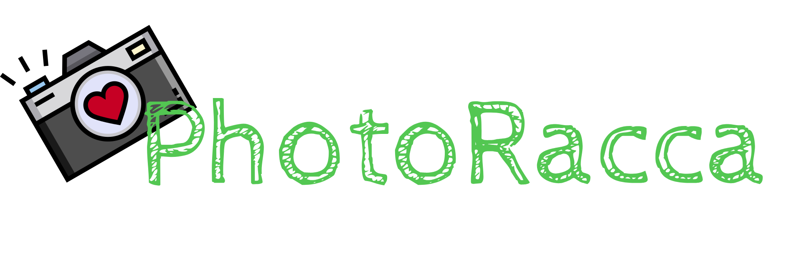

# Photoracca App
### Version: 0.3.0-Alpha
### Features:
- Add up to 4 shots
- Locally stored on your device, once close you can't retrived it back
- Free and Open Source For Personal usage even to everyone who wants to get acc
- Native App to work offline (Coming soon)

### Upcoming Featues:
- Mobile App Support
- Working on mobile so stick to PC/Web for now
- Public Release 

### Platform Availability:

| Platforms | Web | App |
|---|---|---|
| Windows | ✅ | ✅ |
| MacOS   | ✅ | 🏗️ |
| Linux   | ✅ | 🏗️ |
| Android | 🏗️ | 🏗️ |
| FreeBSD | 🏗️ | 🏗️ |
| OpenBSD | 🏗️ | 🏗️ |
| HaikuOS | 🏗️ | 🏗️ |

### LICENSE:
- REPO: **MIT License**
- Binary: **Apache License** (Personal and small businesses) **Proprietary** (Commercial Usage even to big scale ones)

_____
### Why I created this app?
Well I just watched from a YouTube Tutorial which sounds like a tutorial hell thingy yet that's where most of use come from tho and there are lots of features will be available in the future and also as I observed that:

### `Background of the Study`

Some Students are trying to take a moment in every events yet they can't have afford to access to it despite of the price and also the printing and release of the photos after the event was taking too long and it takes 2 - 4 days approximately and even students can't customize their photos before it print and keep as thier souviener

### `Target Audience`

Anyone and mostly Students even instructors who want to set-up the photobooth right at the computer with camera or even fingertips so they can keep the memories as they enjoy with
_____

### Why FOSS?
Well that was my idea to go to especially when it comes to these stuff some make it proprietary, but we don't blame them because that's what they want tho so mine was different but yeah, when it comes to monetization I can accept PayPal and GCash to continue this work and other projects

### Acknowledgement:
Thanks to kuya Mahk Johnrex for motivate me creating an application using ReactJS as of now, Thanks to the teachers (Sir Franco, Maam Elizabeth, Sir Shane and Maam Mora for appreciating my Idea) and to Sir Alvin and The Honeycomb for making me having an idea to create this photobooth app to ensure that anyone can access to this. Also to my fellow classmates (Sahania, Mary Joy, Madilyn, Sharmaine, Cyrille(Stubborn a bit yet she can understand me), Glenda, Sherriemae and everyone who witness my effort to create this WebApp)
___

DISCLAIMER:
This software was cooperated between Human and AI as I'm still new in using JavaScript and This Framework as well 
___
### Support:
Even though I'm an Minecraft Add-on creator yet I tried to create a application like this tho at least I tried to create a non-minecraft stuff as long as I can enjoy and benefit to others as well, you can support me via:
### Patreon [Click Here](https://www.patreon.com/RMPlaysMC_YT)
### GCash (R***el M. 09380355516)
### PayPal [Click Here](https://paypal.me/rmplaysmcyt)
___

### Frameworks used:

### Libraries and References
- FileSaverJS [MIT LICENSE](https://www.npmjs.com/package/file-saver)